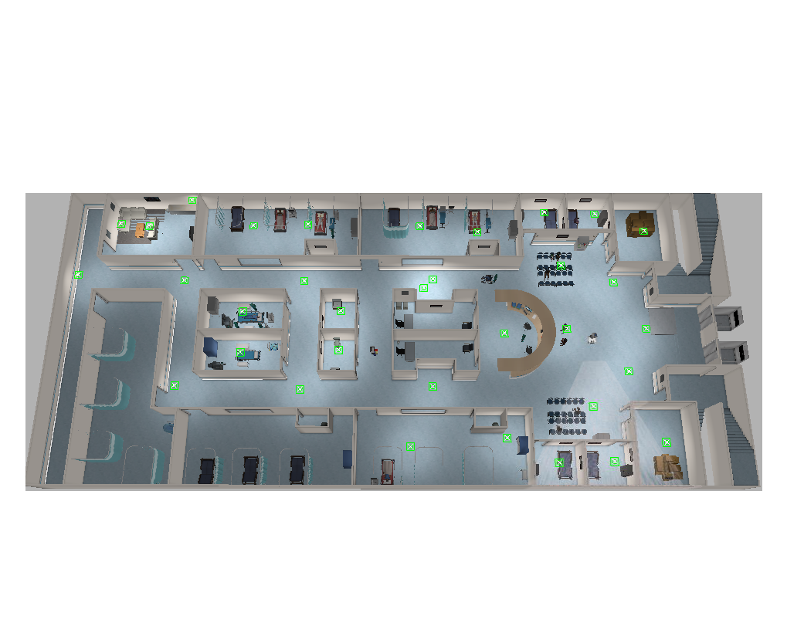
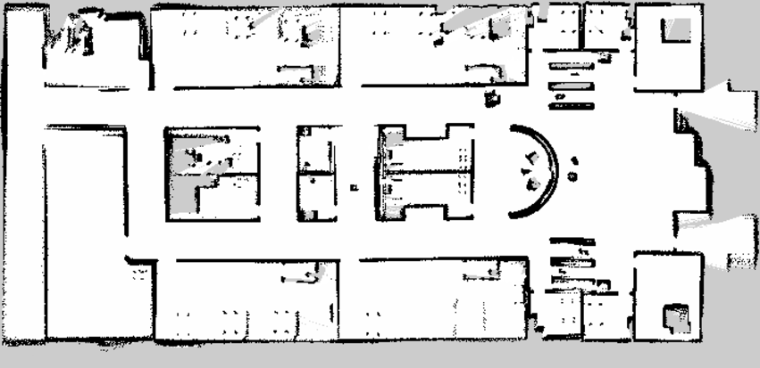
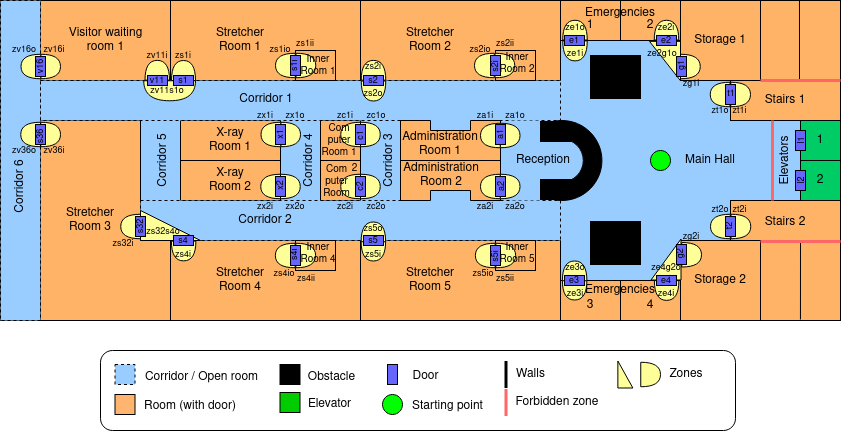

# plansys2-hospital
Repository for planning and move through the [hospital map](https://github.com/aws-robotics/aws-robomaker-hospital-world#readme) using [plansys2](https://intelligentroboticslab.gsyc.urjc.es/ros2_planning_system.github.io/).

## Map
Here we can see images of the gazebo world, the map created by the robot and the scheme that we will follow to define the problem in pddl format:

## PDDL
...

## Authors

 - Javier de la Canóniga: @javi-dbgr
 - Iván López: @ivrolan
 - Alejandro Moncalvillo: @Amglega
 - Unai Sanz: @USanz
