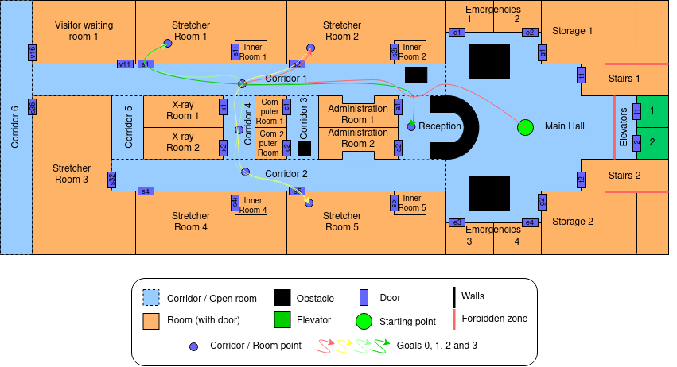

# plansys2-hospital
Repository for planning and move through the hospital map using plansys2.

## Map
Here we can see images of the real map (in gazebo) and the scheme that we will follow to define the problem in pddl format:

