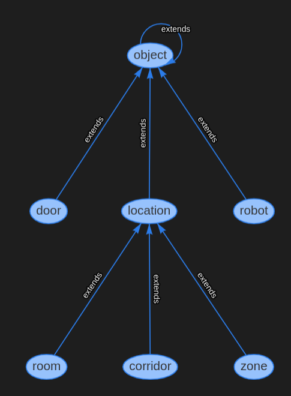

# plansys2-hospital
Repository for planning and move through the [hospital map](https://github.com/aws-robotics/aws-robomaker-hospital-world#readme) using [plansys2](https://intelligentroboticslab.gsyc.urjc.es/ros2_planning_system.github.io/).

## How to run
Launch the plansys2 bringup and action nodes + the gazebo world

    ros2 launch plansys2_hospital_l4ros2 plansys2_hospital_launch.py
    
Then launch the navigation separately:

    ros2 launch br2_navigation tiago_navigation.launch.py map:=/home/ivrolan/foxy_ws/src/plansys2-hospital-l4ros2/maps/hospital_map.yaml
    
The plansys2 controller that commands the different goals:
    
    ros2 run plansys2_hospital_l4ros2 hospital_controller_node
    

## Map
Here we can see images of the gazebo world, the map created by the robot and the scheme that we will follow to define the problem in pddl format:

## Navigation

    ros2 launch br2_navigation tiago_navigation.launch.py map:=/home/ivrolan/foxy_ws/src/plansys2-hospital-l4ros2/maps/hospital_map.yaml
It cannot be added to our launcher

## PDDL
The domain types hierarchy follows this scheme:

## Authors

 - Javier de la Canóniga: @javi-dbgr
 - Iván López: @ivrolan
 - Alejandro Moncalvillo: @Amglega
 - Unai Sanz: @USanz
