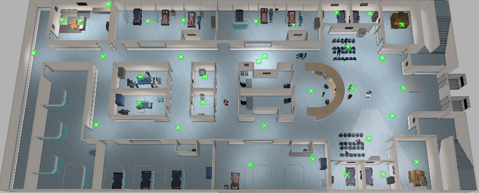

# plansys2-hospital
Repository for planning and move through the [hospital map](https://github.com/aws-robotics/aws-robomaker-hospital-world#readme) using [plansys2](https://intelligentroboticslab.gsyc.urjc.es/ros2_planning_system.github.io/).

## Map
Here we can see images of the real map (in gazebo) and the scheme that we will follow to define the problem in pddl format:

## Navigation

    ros2 launch br2_navigation tiago_navigation.launch.py map:=/home/ivrolan/foxy_ws/src/plansys2-hospital-l4ros2/maps/hospital_map.yaml
It cannot be added to our launcher

## PDDL
...

## Authors

 - Javier de la Canóniga: @javi-dbgr
 - Iván López: @ivrolan
 - Alejandro Moncalvillo: @Amglega
 - Unai Sanz: @USanz
